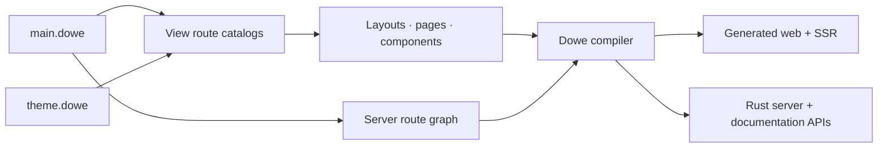

<div align="center">


# Dowe Docs

<p><strong>The official Dowe documentation application</strong></p>

**Documentation, examples, and UI blocks—built with Dowe itself.**

[](https://dowe.dev)


[Website](https://dowe.dev) · [Run locally](#run-locally) · [Project structure](#project-structure) · [Dowe toolchain](../dowe-lang)

</div>

---

## About this project

`dowe-docs` is the maintained documentation experience for Dowe and a fullstack reference
application written in Dowe Source Format. It uses the same public language, compiler pipeline,
design system, route model, server runtime, and generated output that Dowe projects use.

The application brings together:

- **Product introduction** — the mental model behind fullstack systems for the AI era.
- **Views and UI** — layouts, state, interaction, responsive behavior, components, and Canvas.
- **Server and runtime** — routing, HTTP, TLS, Database, Cache, Vector, crypto, sessions, and spawn.
- **Development** — installation, local workflows, tests, deployment, icons, agents, and editors.
- **Examples and blocks** — complete routed examples and reusable visual compositions.

Because the documentation is built with Dowe, every page also acts as an executable example of the
framework's architecture.

## Architecture



The project deliberately has no Node.js application layer. Source is compiled by Dowe, visual
defaults live in `theme.dowe`, server capabilities stay under `server/`, and all generated
development output stays under `.dowe/`.

## Documentation areas

| Area | Local route | Content |
| --- | --- | --- |
| Home | `/` | Dowe's system model, targets, installation, and core principles. |
| Views | `/docs/views` | Components, layouts, styles, state, logic, forms, navigation, charts, and Canvas. |
| Server | `/docs/server` | Runtime capabilities, routing, data access, security, and infrastructure. |
| Development | `/docs/dev` | CLI workflows, agents, testing, deploy, icons, and editor support. |
| Examples | `/examples/*` | Focused application and layout examples. |
| Blocks | `/blocks/*` | Designed sections and full-page previews built from Dowe components. |

## Run locally

### Requirements

- Dowe CLI `1.0.5` or newer.
- A terminal on macOS, Linux, or Windows.
- Cloudflare D1 credentials only when exercising the live icon catalog API.

Install Dowe on macOS or Linux:

```bash
curl -fsSL https://get.dowe.dev/install | bash
```

<details>
<summary>Windows PowerShell</summary>

```powershell
irm https://get.dowe.dev/install.ps1 | iex
```

</details>

### Start the documentation application

From this directory:

```bash
cp .env.example .env
dowe dev --target server --target web
```

Dowe prints the active development URLs after compilation. The generated files under `.dowe/` are
disposable build artifacts and must not be edited as source.

For view-only work:

```bash
dowe dev --target web
```

## Environment

`.env.example` is the shareable variable-name contract. Copy it to the ignored `.env` file and
replace only the values required for the integration you are exercising.

| Variable | Purpose |
| --- | --- |
| `BACKEND_URL` | Local server base URL used by generated view requests. |
| `ACCOUNT_ID` | Cloudflare account that owns the documentation D1 database. |
| `CLOUDFLARE_API_TOKEN` | Server-only credential used to access D1. |
| `DATABASE_ID` | D1 database containing the documentation icon catalog. |
| `VECTOR_HOST`, `VECTOR_PORT` | Example Dowe Vector connection settings used in documentation content. |
| `VECTOR_USER`, `VECTOR_PASSWORD`, `VECTOR_DATABASE` | Example Vector account and database names used in documentation content. |

Never commit `.env` or expose server credentials in views, generated client data, screenshots, or
documentation examples.

## Project structure

```text
dowe-docs/
├── main.dowe
├── theme.dowe
├── .env.example
├── assets/
├── server/
│   ├── config/
│   ├── handlers/
│   ├── migrations/
│   └── endpoints.dowe
├── views/
│   ├── components/
│   ├── layouts/
│   ├── pages/
│   ├── routes/
│   └── store/
├── .agents/
└── .dowe/
```

| Path | Ownership |
| --- | --- |
| `main.dowe` | Connects all documentation route graphs and the server API. |
| `theme.dowe` | Owns fonts, semantic colors, themes, and component defaults. |
| `views/routes` | Maps documentation areas and previews to URLs. |
| `views/layouts` | Provides the shells and navigation for each documentation area. |
| `views/pages` | Owns page content, examples, and block previews. |
| `views/components` | Contains shared navigation, brand, and documentation UI. |
| `views/store` | Owns shared reactive documentation preferences. |
| `server` | Provides the server-only icon catalog integration. |
| `assets` | Stores original brand, icon, and example media. |
| `.agents` | Contains project-mode Dowe authoring guidance and validation configuration. |
| `.dowe` | Contains generated development, language, app, and distribution artifacts. |

## Common workflows

| Command | Use |
| --- | --- |
| `dowe dev --target server --target web` | Compile and run the complete documentation application. |
| `dowe dev --target web` | Work on documentation views without starting the server target. |
| `dowe test` | Run native `.dowe` tests discovered in the project. |
| `dowe codegraph check` | Validate ownership, modularity, dependencies, and duplication. |
| `dowe build --target android` | Produce a signed release APK without publishing it. |
| `dowe deploy --target static` | Generate portable web output under `.dowe/dist/static`. |
| `dowe deploy --target android --track internal --publish` | Upload a signed Android App Bundle to Google Play. |
| `dowe deploy --target ios --publish` | Upload a signed IPA to App Store Connect from macOS. |
| `dowe agent update` | Refresh Dowe-managed public authoring skills in `.agents/skills`. |

## Contributing

Keep the documentation application aligned with implemented Dowe behavior:

1. Edit authored files, never generated `.dowe` output.
2. Keep frontend modules under `views/` and backend modules under `server/`.
3. Reuse `theme.dowe` defaults before adding repeated visual props to individual components.
4. Preserve route ownership and the import graph when adding or moving pages.
5. Use current Dowe Source Format in every example.
6. Validate the narrowest affected targets, then run CodeGraph for structural changes.
7. Update documentation, maintained examples, and focused agent guidance together when a public
   authoring contract changes.

Dowe diagnostics are the final authority for accepted syntax, props, bindings, and target support.

---

<div align="center">

**The documentation is part of the product—and the product builds the documentation.**

[Explore Dowe](https://dowe.dev) · [Open the compiler workspace](../dowe-lang)

</div>
